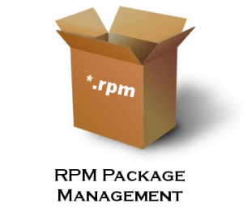

# Paquetes RPM

## Introducción

Qué son los paquetes rpm?

Los paquetes rpm son archivos que contienen el software compilado y listo para instalar en sistemas operativos basados en Red Hat, como Rocky Linux, Fedora o CentOS. El nombre rpm significa Red Hat Package Manager, aunque también se puede usar el comando yum o dnf para gestionar estos paquetes. Los paquetes rpm tienen la extensión .rpm y suelen incluir información sobre el nombre, la versión, la descripción, las dependencias y los scripts de instalación o desinstalación del software1.

